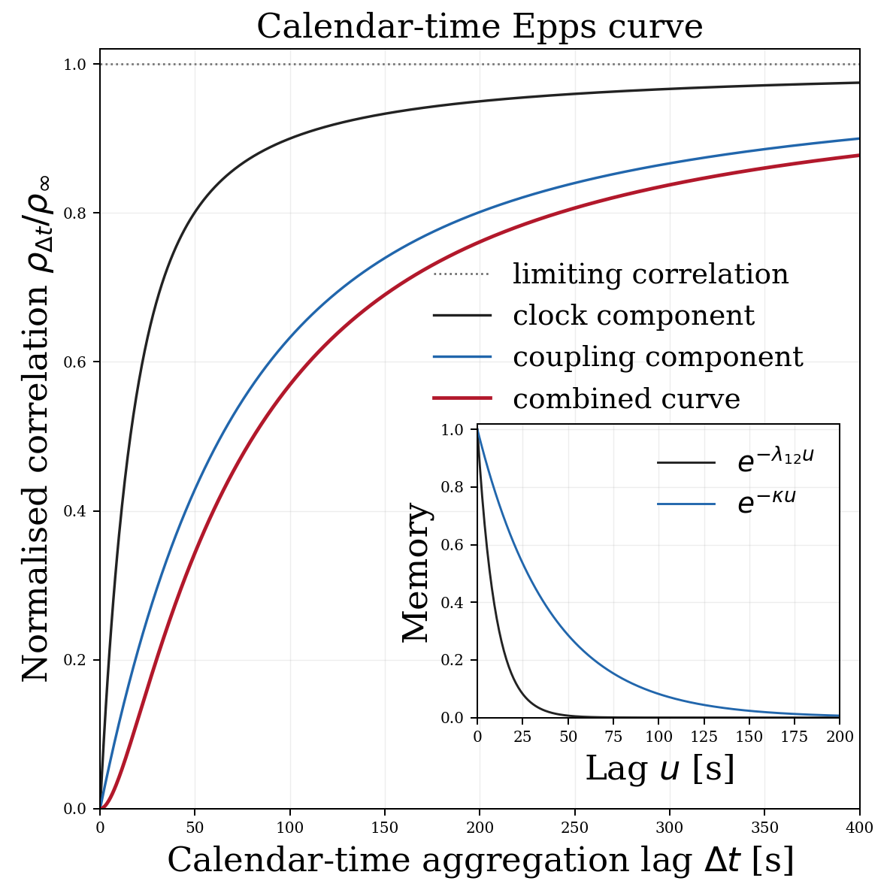

# Correlation emergence reproducibility bundle

Version: v1.0.0

Supplementary code and materials for:

> Chris Angstmann and Tim Gebbie, **“Correlation emergence and the Epps effect in two coupled limit order books,”** [arXiv:2606.14182](https://arxiv.org/abs/2606.14182).

The compiled supplementary-materials document is included here:

> [SUPPLEMENTARY-MATERIAL-v1.0.0.pdf](supplementary-materials/SUPPLEMENTARY-MATERIAL-v1.0.0.pdf)

This repository is a quantitative-finance reproducibility bundle. It evaluates the paper's analytical correlation build-up factors, separates clock and coupling contributions to the Epps effect, examines fractional-order sensitivity, propagates reaction-boundary structure into the response timescale, and diagnoses finite-grid representation effects. The code regenerates the six figures, two tables, numerical diagnostics, sensitivity checks, and machine-readable outputs used in the supplementary material.

## Key figure: calendar-time Epps curve



**Figure 6. Calendar-time Epps curve and analytical memory diagnostics.** The square main panel expresses the slow-response analytical profile on a linear calendar-time axis. Black, blue, and red curves give the clock component, coupling component, and their leading-order separable product; the grey dotted line marks the normalised limiting correlation. The illustrative rates are \(\lambda_{12}=0.1\,\mathrm{s}^{-1}\) and \(\kappa=0.025\,\mathrm{s}^{-1}\), corresponding to characteristic times of 10 s and 40 s. The inset shows the associated analytical no-refresh survival and coupling-relaxation memory functions. This provides the familiar calendar-time Epps representation and a clean analytical reference for later simulation overlays. The seconds scale is illustrative rather than calibrated, and the inset is neither a path autocorrelation nor a power-spectrum estimate; those path-derived diagnostics belong to the v2.0.0 simulation extension.

## Current situation: v1.0.0

The v1.0.0 bundle is a deterministic analytical companion to the paper. It contains:

- ordinary clock, coupling, and combined Epps curves;
- aggregation-scale sensitivity of the ordinary components;
- fractional-order curves and equal-sum short-scale sensitivity;
- conditional propagation from reaction-boundary parameters to Epps curves;
- finite-grid boundary representation and the resulting Epps-curve envelope;
- the calendar-time Epps curve and analytical memory inset shown above;
- two generated publication tables;
- long-form CSV data for every figure and a shared analytical overlay file for v2.0.0;
- numerical diagnostics, robustness checks, and 25 regression/output tests;
- the LaTeX source and compiled PDF of the supplementary material.

This is a **formula-first analytical and numerical reproducibility bundle**. It is not an empirical calibration, a coupled-order-book simulation, a trading strategy, or a production market-data library.

## Future situation: v2.0.0 simulation extension

The planned v2.0.0 extension will convert the Julia simulations associated with [arXiv:2408.03181](https://arxiv.org/abs/2408.03181) into the same Python framework. It is intended to add:

- simulated coupled-order-book price paths;
- conventional event-lag and calendar-time Epps curves with simulation uncertainty;
- path-derived response diagnostics, including autocorrelation and power-spectrum views where supported;
- overlays of simulated curves against the v1.0.0 analytical components;
- controlled experiments on how discrete boundary representation affects the observed Epps curves.

The analytical definitions and machine-readable overlay fields in v1.0.0 are retained as the comparison baseline.

## Scientific boundary

The bundle evaluates theoretical objects from the paper under stated approximation and normalisation choices. It does not simulate the coupled limit order books, fit market data, calibrate parameters, reproduce the legacy Julia figures, or treat numerical agreement as proof of the model. The decaying Gaussian is the active source convention. Reaction-front slope, continuum selector width, and lattice spacing remain distinct quantities, and the combined Epps curve alone does not identify both fractional orders or all boundary parameters.

## Repository structure

```text
config/                  Numerical parameter profiles
functions/               Reusable analytical and numerical functions
scripts/                 Reproduction commands
tests/                   Regression and generated-output tests
data/                    Data instructions; no empirical data are required
outputs/                 Figure data, sensitivity summary, and v2 overlay CSV
figures/                 Six generated PDF/PNG figure pairs
tables/                  Two generated CSV/LaTeX table pairs
captions/                Standalone captions for figures and tables
diagnostics/             Numerical and robustness results
supplementary-materials/ Compiled supplementary-materials PDF
source/source-v0/        Associated paper source used for notation checks
provenance/              Scientific assumptions, numerical methods, and output maps
```

## Installation

From a fresh clone:

```bash
python -m venv .venv
```

Activate the environment.

On Windows PowerShell:

```powershell
.venv\Scripts\Activate.ps1
```

On Windows CMD:

```cmd
.venv\Scripts\activate.bat
```

On macOS/Linux:

```bash
source .venv/bin/activate
```

Then install the requirements:

```bash
python -m pip install --upgrade pip
python -m pip install -r requirements.txt
```

## Reproducing the active outputs

Run the complete reproducibility command:

```bash
python scripts/run_all.py
```

The expected final line is:

```text
Active v1.0.0 reproducibility route completed successfully.
```

The command regenerates or verifies figures, tables, CSV outputs, numerical diagnostics, sensitivity checks, and 25 tests. To run the tests independently:

```bash
python -m unittest discover -s tests -v
```

## Execution verification

The v1.0.0 bundle has completed the following checks:

- 14 numerical diagnostics verified, 0 failed;
- 16 sensitivity and robustness checks verified, 0 failed;
- 25 regression and output tests passed, 0 failed;
- all six PDF/PNG figure pairs rendered and were visually inspected;
- the 12-page supplementary PDF compiled without unresolved references or overfull boxes;
- the author reproduced the complete route on Windows with Python 3.13.14: 25 tests, 0 failures;
- the minimalist supplementary-materials archive compiled successfully in Overleaf and was visually accepted.

### Note on regenerated PDF figures

Matplotlib PDF files can differ byte-for-byte across systems because of renderer metadata, font embedding, or backend versions. Reproducibility is assessed from the scientific curves, CSV values, table contents, figure structure, and diagnostic results rather than byte-identical PDF files.

## Version-control policy

Recommended tags:

```text
v1.0.0        first public analytical reproducibility release
v1.0.1        documentation-only corrections
v1.1.0        compatible analytical or diagnostic enhancements
v2.0.0        Julia-to-Python simulation conversion and analytical overlays
```

## Citation and license

Suggested paper citation:

Angstmann, Chris; Gebbie, Tim (2026). *Correlation emergence and the Epps effect in two coupled limit order books*. arXiv:2606.14182.

| Item | Value |
|---|---|
| Associated paper | [arXiv:2606.14182](https://arxiv.org/abs/2606.14182) |
| Supplementary PDF | [SUPPLEMENTARY-MATERIAL-v1.0.0.pdf](supplementary-materials/SUPPLEMENTARY-MATERIAL-v1.0.0.pdf) |
| Code license | MIT License |
| Supplement, text, figures, and tables | CC BY 4.0 |

Repository and release links can be added to this section when the public v1.0.0 release is created. See `CITATION.cff` for machine-readable citation metadata.

## License

Code is released under the MIT License.

Supplementary text, captions, generated figures, tables, and documentation are released under CC BY 4.0 unless otherwise stated.

The associated paper retains its own arXiv and publication terms and is not relicensed by this repository. See `LICENSE` and `CONTENT-LICENSE.md`.
