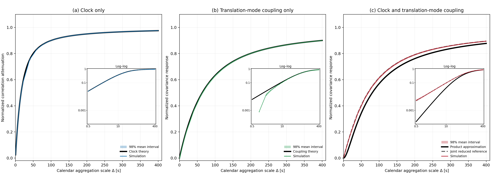
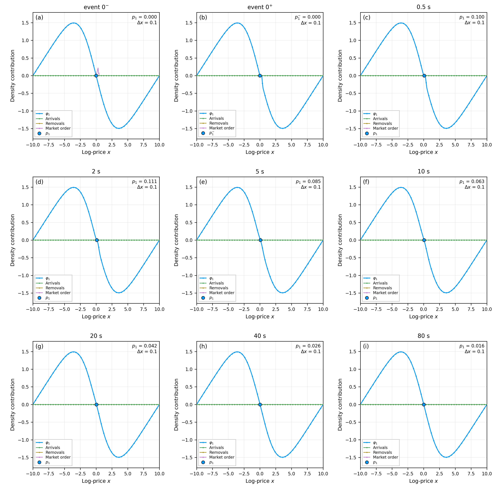
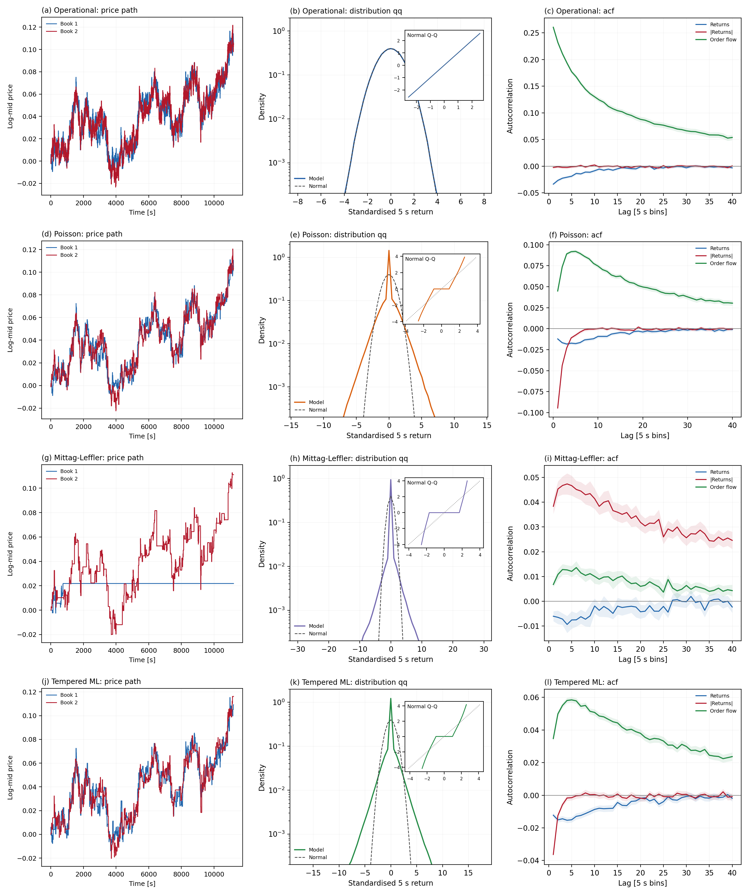

# Correlation emergence reproducibility bundle

Version: v2.1.0 development candidate

Supplementary code and materials for:

> Chris Angstmann and Tim Gebbie, **“Correlation emergence and the Epps effect
> in two coupled limit order books,”**
> [arXiv:2606.14182](https://arxiv.org/abs/2606.14182).

The supplementary-materials document is included here:

> [SUPPLEMENTARY-MATERIAL-v2.1.0.pdf](supplementary-materials/SUPPLEMENTARY-MATERIAL-v2.1.0.pdf)

This repository is a quantitative-finance reproducibility bundle. It extends
the analytical v1.0.0 materials with a Python implementation of two
coupled order books, explicit separation of operational and calendar time, and
event-impact and dependence diagnostics. The code regenerates or verifies the
thirteen selected figures, two publication tables, numerical diagnostics and
machine-readable evidence used in the supplementary material.

## Key figure: theory and simulation



**Figure 7. Clock, coupling and combined Epps curves: theory and simulation.**
Figure 7(a) compares the clock-only simulation with the exact equal-rate
previous-refresh factor $F(\lambda^{\rm clk}\Delta)$, where each book has
$\lambda^{\rm clk}=0.1\,\mathrm{s}^{-1}$. This rate is distinct from the
$0.2\,\mathrm{s}^{-1}$ pooled minimum-wait rate. Figure 7(b) compares the
translation-mode coupling simulation with $F(\kappa\Delta)$, using
$\kappa=0.025\,\mathrm{s}^{-1}$. Figure 7(c) compares the combined simulation
with the paper's leading-order separable product
$F(\lambda^{\rm clk}\Delta)F(\kappa\Delta)$ and the same-clock conditional
reference. The latter evaluates the reduced finite-step conditional moment at
the same realised previous-refresh indices as the simulation; it is not a
fitted curve. The three square panels share the same linear 0--400 second and
0--1.1 normalized-covariance scales. The same-clock reference reduces combined
RMSE from `0.066963` to `0.039719`, with standardized RMSE `0.455132` and full
pointwise 95% normal-band coverage. No clock, coupling, boundary, normalization
or simulation parameter is refitted.

The [machine-readable curves](outputs/final-estimator-aware-epps-curves-v1.9.csv)
and [summary statistics](outputs/final-estimator-aware-epps-summary-v1.9.csv)
retain their frozen development identifiers.

## Current situation: v2.1.0

The current bundle separates the model into three operations:

1. both order-book densities evolve on one uniform operational-time grid;
2. labelled limit-order, market-order and meta-order events act on that grid;
3. completed paths are observed through separate book-specific calendar clocks
   by explicit previous-refresh subordination.

Calendar waiting intervals never enter the density recurrence. Calendar prices
are previous-completed-state observations; no interpolation, extrapolation or
nonuniform state update is used.

The current v2.1.0 development bundle contains:

- the six analytical figures and two publication tables retained from v1.0.0;
- clock-only, translation-mode coupling-only and combined no-refit
  comparisons;
- receiving-front translation-mode coupling on uniform operational
  time;
- separate book-specific calendar clocks and previous-refresh subordination;
- paired single-trade and scheduled meta-order own/cross-impact simulations;
- log-mid increment and trade-sign autocorrelation diagnostics;
- fixed-time order-book shock recovery on the operational grid;
- operational/calendar stylised-facts diagnostics with six standalone square
  panels and one assembled Figure 13;
- the frozen target-paper source and the v2 computational supplement; and
- one strict reproducibility entry point with a used-tree `--rerun` mode.

The public figure sequence is deliberately compact:

| Figure | Evidence |
|---|---|
| 1--6 | Analytical mechanism, sensitivity, finite-grid and calendar-time results |
| 7 | Clock, coupling and combined Epps theory-to-simulation comparison |
| 8 | Translation-mode coupling recovery on uniform operational time |
| 9 | Paired single-trade own- and cross-impact simulation |
| 10 | Scheduled meta-order own- and cross-impact simulation |
| 11 | Log-mid increment and trade-sign autocorrelations across event, operational and calendar layers |
| 12 | Fixed-time order-book shock recovery and reaction-boundary relaxation |
| 13 | Operational and previous-refresh calendar stylised-facts comparison |

Figure 11 includes log-mid increment autocorrelation, event-time trade-sign
autocorrelation, subordinated signed-flow autocorrelation and sign-convention
agreement. Price-level autocorrelation is intentionally excluded. Its
operational five-second ACF is a registered finite periodic-schedule
diagnostic, and the detailed curve is phase-sensitive to that schedule.

### Figure 12: fixed-time shock recovery



Figure 12 follows a buy market order from the pre-event density through the
post-consumption state and 80 seconds of fixed operational-time relaxation.
All density contributions use one common scale. The zero cancellation curve is
retained because the accepted model sets both cancellation rates to zero; it is
not inflated for visibility. The high-resolution PNG is 4500 by 3600 pixels.

### Figure 13: operational and calendar stylised facts



Figure 13 uses irregular background market-order arrivals and compares the
same completed model paths before and after previous-refresh observation. Its
baseline uses ordinary operational order, `alpha_u=1`, zero cancellation and
a Poisson refresh clock. It does not claim fractional operational memory, a
non-Markovian calendar clock or empirical calibration. The top row is the
uniform operational path and is therefore smoother and closer to Gaussian.
The bottom row observes those same paths through book-specific previous refresh;
held prices create a 60.49% zero-return atom, a sharp central spike, an extended
QQ plateau and stronger apparent tails. The lower-row leptokurtosis is an
observation-clock effect, not a change in the underlying operational dynamics.

### Legacy Julia implementation from [arXiv:2408.03181](https://arxiv.org/abs/2408.03181)

The numerical antecedent is the Julia implementation for Bauer, Diana and
Gebbie, *Correlation emergence in two coupled simulated limit order books*,
available as
[`DominicGBauer/InteractingLOBs.jl`](https://github.com/DominicGBauer/InteractingLOBs.jl)
and audited here at commit
[`c8206c6`](https://github.com/DominicGBauer/InteractingLOBs.jl/commit/c8206c66906580516d2389b57c6955bb2f526862).
That codebase extends the earlier single-book Julia implementation deposited by
Diana and Gebbie at
[ZivaHub, DOI 10.25375/uct.22810559.v1](https://doi.org/10.25375/uct.22810559.v1).
The legacy code was first converted and tested as a distinct development stage.
The conversion was then used to identify the time-update, source and coupling
interfaces that had to be changed for the present implementation. Its
executable surface, stored simulations and development-only tests are not
shipped in v2.0.0; the staged Git history and
[implementation-differences record](provenance/BAUER-ANTECEDENT-AND-CORRECTIONS-v2.md)
preserve the audit trail.

The source convention is
$q_j(y)=-a_j\mu_j y\exp(-\mu_j y^2)$, and coupling acts directly through the
receiving front's translation mode. The resolved density therefore supplies
the numerical boundary width. The bounded regularized source in the paper is
retained as an analytical weak/local moment closure. Its relation to the
numerical translation mode is after projection onto front displacement, not as
pointwise equality of the two kernels.

## Future situation: possible extensions

Possible later extensions include:

- empirical comparison with market order-book and transaction data;
- calibration of clock, coupling and event parameters under an explicit
  identification strategy;
- additional limit-order, cancellation and strategic execution mechanisms;
- endogenous or long-memory trade-sign processes rather than the present
  finite Markov fixture;
- more than two coupled books and a general cross-impact network; and
- locked containers, continuous integration and broader platform testing.

These are possible extensions, not claims made by the current release.

## Scientific boundary

This is a simulation and interpretation bundle for the associated paper and
supplement. It is not an empirical market-data calibration, a trading strategy
or a production execution library. The same-clock conditional reference
represents the accepted finite-step conditional moment; it is not a fitted
replacement for the paper's leading-order mechanism decomposition. Reaction
front slope, analytical regularization width, lattice spacing and the numerical
translation mode remain distinct objects.

The target-paper source in `source/source-v1/` remains frozen. Computational
clarifications and implementation distinctions are recorded in the README, the supplement and
`source/source-v2/`.

## Repository structure

```text
config/                  Accepted scientific and release configurations
functions/operational/   Uniform-grid density and translation-mode coupling
functions/observation/   Clocks, previous-refresh sampling and subordination
functions/events/        Order-event records, tapes and impact operations
scripts/                 Active reproduction and verification commands
tests/                   Compact claim-bearing regression suite
data/                    Data instructions; no empirical data are required
outputs/                 Machine-readable curve and summary evidence
figures/                 Thirteen selected PDF/PNG figure pairs plus six Figure 13 panels
tables/                  Two generated CSV/LaTeX publication tables
captions/                Standalone captions for the selected evidence
diagnostics/             Generated scientific acceptance checks
source/source-v1/        Frozen Angstmann--Gebbie target-paper source
source/source-v2/        Computational conformity and clarification inserts
provenance/              Theory-to-code and numerical traceability
supplementary-materials/ Compiled computational supplement
```

Scientific object versions such as `config-v1.7.7.json` and output suffixes
such as `-v1.8.csv` are retained where they identify an accepted development
object. The current development documentation uses v2.1.0. The public v2.0.0
tag and its release assets remain unchanged.

## Installation

Python 3.12 is the controlled release environment. The complete route was also
verified on Windows with Python 3.13. NumPy, Matplotlib and pypdf are pinned
exactly by `requirements.txt`.

Tracked text files are normalized to LF by `.gitattributes`, including on
Windows. Binary figures, archives and Git bundles are explicitly excluded from
text conversion so a standard clone preserves manifest-relevant bytes.

From a fresh clone:

```bash
python -m venv .venv
source .venv/bin/activate
python -m pip install --upgrade pip
python -m pip install -r requirements.txt
```

On Windows PowerShell:

```powershell
py -3.13 -m venv .venv
Set-ExecutionPolicy -Scope Process -ExecutionPolicy RemoteSigned
& .\.venv\Scripts\Activate.ps1
python -m pip install --upgrade pip
python -m pip install --no-cache-dir --progress-bar off -r .\requirements.txt
```

## Reproducing the active outputs

From a fresh clone or newly extracted archive, run:

```bash
python scripts/run_all.py
```

The default mode is strict. It verifies the pinned runtime and the archive
manifest before executing the retained analytical and simulation route, the
scientific tests and immutable-source verification.

For a repeat in an already-used tree:

```bash
python scripts/run_all.py --rerun
```

Rerun mode still checks the runtime and immutable inputs. Generated artifacts
are assessed by numerical, schema, figure and scientific tests rather than by
cross-platform byte identity.

## Execution gates passed

The frozen v2.0.0 candidate passed the complete strict route from a fresh
extraction:

- 425 verified scientific and configuration checks;
- 6 explicitly retained qualified full-model checks and no failed checks;
- 28 of 28 final-release checks;
- 225 of 225 retained regression tests; and
- 159 of 159 immutable scientific and reproducibility entries.

PDF bytes can differ across platforms because of renderer metadata, font
embedding or compression. Reproducibility is assessed from frozen inputs,
machine-readable values, declared tolerances and claim-bearing tests rather
than cross-platform PDF byte identity.

The v2.1.0 Figure 12 and Figure 13 gates add fixed-time shock recovery and the
accepted stylised-facts comparison without changing the frozen v2.0.0 tag or
target-paper source. Figure 13 passed 162 registered checks and 11 independent
reconstruction tests at its production gate.

## Version-control policy

The public version history follows semantic versioning:

```text
v1.0.0        first public analytical reproducibility release
v2.0.0        simulation, subordination, impact and dependence release
v2.0.1        documentation or metadata updates without a scientific change
v2.1.0        compatible diagnostics or scientific extensions
v3.0.0        incompatible model, interface or scientific-scope change
```

The development lineage within v2 is retained in filenames, the changelog and
Git history:

| Version | Established or changed | Status in v2.1.0 |
|---|---|---|
| `v1.2.x` | Julia-to-Python conversion and declared-input reconstruction | Retired executable; audit retained |
| `v1.4.x--v1.5.x` | Uniform operational dynamics and explicit calendar subordination | Retained core |
| `v1.7.7` | Receiving-front translation-mode coupling and source convention | Retained core and Figure 8 |
| `v1.8.0--v1.8.3` | Event semantics, impact and dependence diagnostics | Retained in Figures 9--11 |
| `v1.9.0` | Final theory-to-simulation Epps integration | Retained as key Figure 7 |
| `v1.9.2` | Slim public payload and claim-equivalence gate | Accepted parent stage |
| `v1.9.3` | Legacy executable retirement and final public evidence map | Accepted final gate |
| `v2.0.0` | Public promotion of the accepted v1.9.3 scientific payload | Frozen public release |
| `v2.1.0` | Fixed-time shock recovery and operational/calendar stylised-facts diagnostics | Current development candidate |

The latest public Git tag remains `v2.0.0`. The GitHub Release title is
**v2.0.0 — Reproducibility code for arXiv:2606.14182**, and its release asset is
`correlation-emergence-reproducibility-v2.0.0.zip`.
No v2.1.0 tag or GitHub Release has been created.

## DOI, citation and license

ZivaHub/Figshare DOI: https://doi.org/10.25375/uct.33368986

Suggested paper citation:

> Angstmann, Chris; Gebbie, Tim (2026). *Correlation emergence and the Epps
> effect in two coupled limit order books*. arXiv:2606.14182.

| Item | Value |
|---|---|
| Associated paper | [arXiv:2606.14182](https://arxiv.org/abs/2606.14182) |
| Supplementary PDF | [SUPPLEMENTARY-MATERIAL-v2.1.0.pdf](supplementary-materials/SUPPLEMENTARY-MATERIAL-v2.1.0.pdf) |
| GitHub repository | `https://github.com/timgebbie/correlation-emergence-reproducibility` |
| ZivaHub/Figshare DOI | https://doi.org/10.25375/uct.33368986 |
| Code license | MIT License |
| Supplement, text, figures and tables | CC BY 4.0 |

Code is released under the MIT License. Supplementary text, captions,
generated figures, tables and documentation are released under CC BY 4.0
unless otherwise stated. The associated paper retains its own arXiv and
publication terms and is not relicensed by this repository. See `LICENSE`,
`CONTENT-LICENSE.md` and `CITATION.cff`.
